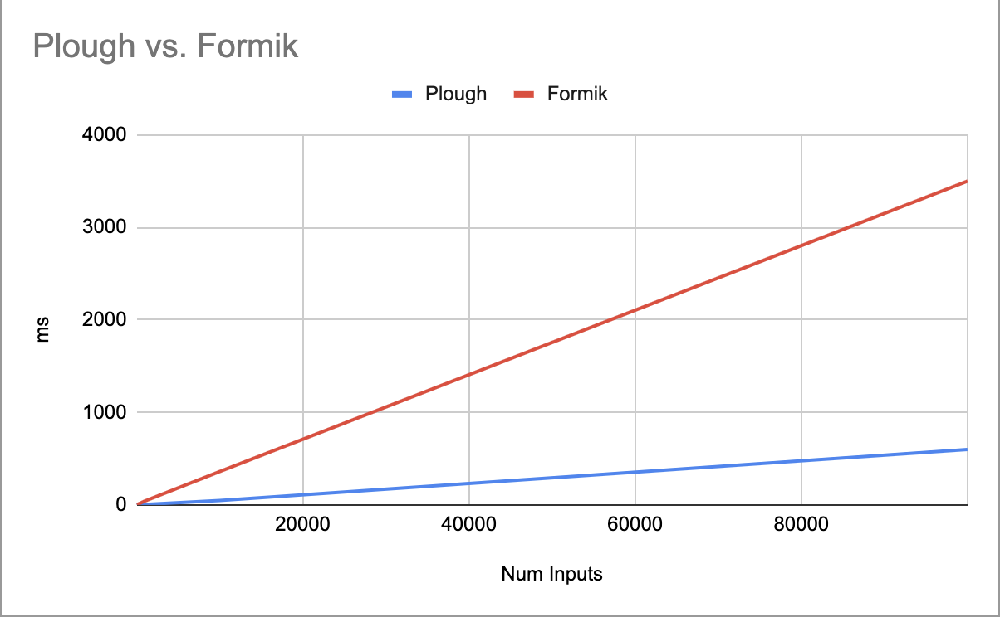

<h1 align="center">React Plough 👨‍🌾</h1>

<p align="center">
    
</p>

> A library to help tend your react fields

```sh
yarn add react-plough
npm i react-plough
```

`react-plough` is yet another react form library. It prioritises developer experience and aims to reduce user error by providing strongly typed and performant interfaces for react form fields. Unlike existing form libraries, `plough` does not use react context and does not require any manual type annotation. In other words, it is lightweight and hard to screw up.

> `plough` is 3 to 700x faster than Formik \*(see bottom)

Play with the [Formik comparison](https://codesandbox.io/s/react-plough-vs-formik-flv9u?file=/src/App.tsx)

Check out the [Docs](https://react-plough.vercel.app/)

---

## Basic Usage

Plough views fields as the atomic unit of user-input and uses a familiar API, but is designed as a library, not a framework. As such, plough fits around your code, instead of fitting your code around itself. A basic example looks like:

```ts
import { useTextField } from "react-plough";

const LoginForm = () => {
  const [nameProps, name] = useTextField({
    validate: (name) =>
      name.value.length === 0 ? "Name must be provided" : undefined,
  });

  const [passwordProps, password] = useTextField({
    validate: (password) =>
      password.value.length === 0 ? "Password is required" : undefined,
  });

  const handleSubmit = () => {
    alert(`${name.value} ${password.value}`);
  };

  return (
    <div>
      <input {...nameProps} />
      <input {...passwordProps} />
      <button onClick={handleSubmit}></button>
    </div>
  );
};
```

The fields are not dependent on each other and don't use any react context. This means it causes the minimum amount of re-renders, and gradual adoption is simple. In the basic case, plough acts like a glorified `useState` with some input-specific helpers.

However, forms often exist across several layers of the DOM tree, have lists of fields and have more complicated requirements. As such, opt-in utilities exist to enable complicated use-cases too.

---

## A more realistic example

Bear in mind that all of the below is strongly typed -- no guessing or type annotation required

```ts
const form = createForm({
  name: "",
  age: "8", // HTML <input/> numbers are still strings
  friendNames: [""],
});

export const ProfileForm = () => {
  const [nameProps] = form.useName();
  const [ageProps] = form.useAge({
    validate: (val) => (Number(val) < 18 ? "Must be over 18" : undefined),
  });

  return (
    <div>
      <input {...nameProps} />
      <input {...ageProps} type="number" />
      <FriendForm />
    </div>
  );
};

// <name> or <age> won't trigger updates here
export const FriendForm = () => {
  const [friends, friendsActions] = form.useFriendNames();

  const handleSave = () => {
    const [values, meta] = form.collect(); // Includes <name> and <age>
    if (!meta.isDirty) {
      throw new Error("Please add some friends");
    }
    alert(values);
  };

  return (
    <div>
      {friends.map((friend, i) => (
        <div>
          <input {...friend.props} />
          <button onClick={friend.actions.remove}>Delete</button>
        </div>
      ))}
      <button onClick={friendsActions.addItem}>Add friend</button>
      <button onClick={handleSave}>Save</button>
    </div>
  );
};
```

Check out the other [functions](https://react-plough.vercel.app/modules.html#composeform) exported from plough to see other helpers

## Notes on the Formik Comparison and Performance

> In most cases, performance won't be that important. But when forms do have performance issues, these issues are often hard to fix and very problematic

> While this describes Formik, most of the points here apply to other existing form libraries, as they tend to use the same underlying approach

The [Formik comparison](https://codesandbox.io/s/react-plough-vs-formik-flv9u?file=/src/App.tsx) evaluated various things like number of sibling component re-renders, time to re-render and time to pull out values upon submission. To do this, many inputs (from 1 to 100,000) were created. Of course, no one will likely ever need 100,000 inputs, but this case emulates the behaviour of, say, having expensive calculations run in only a few components.

**Sibling re-renders**

Formik causes a re-render of sibling components (within the `<Formik/>` component) when any field in that component changes. Conversely, plough does not do this. So, in effect Formik renders sibling components potentially infinitely more than plough.

**Extracting form values for submission**

The disparity between Formik and plough here is surprising. With 100,000 inputs, Formik takes 7000ms to retrieve the values, whereas plough only takes 10!

**Input-Re-render delay**

Across every scale of evaluation, plough outperformed Formik. While smaller trials showed a difference that is negligible in practice, the larger trials showed the fundamental difference in performance between the two libraries.


